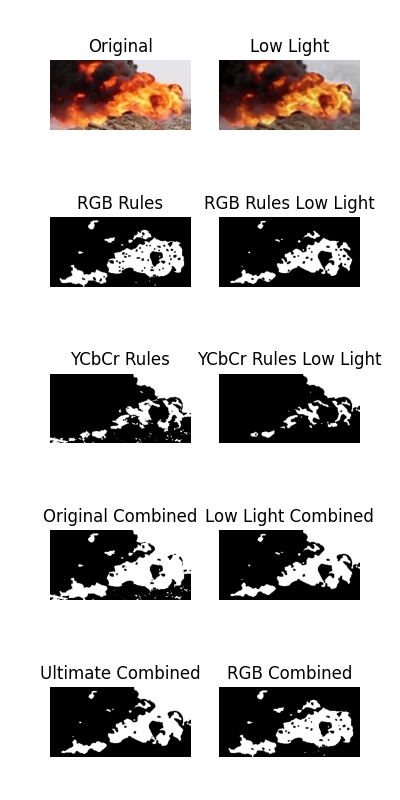

# Fire Segmentation using YOLOv8 and Image Processing Techniques

## Introduction

The goal of this project is to segment the image into 2 class, fire and non fire, in images using the YOLOv8 object detection algorithm and image processing techniques. The segmentation are done by using the YOLOv8 algorithm to detect the fire and the image processing techniques to segment the fire pixel from the image.

## Dataset

The dataset used in this project are gathered from the roboflow universe, which are the combination of the [Fire Smoke Dataset 1](https://universe.roboflow.com/buitems-ycaeh/fire-smoke-datasets/dataset/1) and [Fire Smoke Dataset 2](https://universe.roboflow.com/latifa-sassi-zqgnz/fire-smoke-mx4z8/dataset/1). Each dataset contains around 9000 images of fire and non fire images. The dataset are then split into 3 parts, which are the training set, validation set, and test set. The training set contains 70% of the dataset, the validation set contains 20% of the dataset, and the test set contains 10% of the dataset. The dataset are then converted into the YOLOv8 format directly from the website. Which will be used in the training process of the YOLOv8 algorithm.

## Proposed Method

### Detection

The detection are done by using the YOLOv8 algorithm. The YOLOv8 algorithm are trained using the training set and validated using the validation set. One of the result of the detection are shown in the image below.

### Segmentation

The segmentation are done purely using image processing techniques. The segmentation are applied to the cropped image of the detected fire. The segmentation are done by using the following steps:

1. Make an enhanced version of the image (for handling low light images) with the following steps:
   1. Convert the image into HSV color space.
   2. Apply histogram equalization to the V channel of the image.
   3. Apply median blur to the V channel of the image.
   4. Convert the image back into BGR color space.
2. Apply RGB rules to both the original and low light enhanced image to get the fire pixel. The rules are:
   1. `R > G > B`
   2. `R > 190` and `G > 90` and `B < 140`
   3. `0.1 <= (G / (R+1)) <= 1` and `0.1 <= (B / (R+1)) <= 0.85` and `0.1 <= (B / (G+1)) <= 0.85`
   4. Apply morphological closing to the image with a 3x3 kernel.
3. Apply YCbCr rules to both the original and low light enhanced image to get the fire pixel. The rules are:
   1. `Y < 145` or `Y >= 170`
   2. `50 <= Cb <= 120`
   3. `120 < Cr < 220`
4. Combine the result of the RGB and YCbCr rules for both the original and low light enhanced image using bitwise OR, respectively called as `combined_img` and `combined_low_light_img`.
5. Combine the result of `combined_img` and `combined_low_light_img` using bitwise AND, called as `ultimate_combined`.
6. Combine the result of RGB rules between the original and low light enhanced image using bitwise OR, called as `rgb_combined`.
7. Compare the similarity for each pixel between `ultimate_combined` and `rgb_combined`, if the overall similarity is above 0.75, then use `rgb_combined` as the final result, otherwise use `ultimate_combined` as the final result. Here are the example for both low similarity percentage and high similarity percentage:

|                 Low Similarity Percentage                 |                 High Similarity Percentage                  |
| :-------------------------------------------------------: | :---------------------------------------------------------: |
|  |  |

Note: The similarity threshold is determined by visual inspection of some sample images.

## Result

The result of the segmentation are shown in the image below.

|              Original Image              |             Segmented Image             |
| :--------------------------------------: | :-------------------------------------: |
|  |  |

## Conclusion

The result of the segmentation are not perfect, but it is good enough to be used as a proof of concept. The result of the segmentation can be improved by using a better image processing techniques and a better similarity threshold. The result of the segmentation can also be improved by using a better dataset, which contains more variety of fire images to avoid false positive detection, both in the detection and segmentation process.

## References

1. [YOLOv8](https://ultralytics.com/yolov8)
2. [Fire Smoke Dataset 1](https://universe.roboflow.com/buitems-ycaeh/fire-smoke-datasets/dataset/1)
3. [Fire Smoke Dataset 2](https://universe.roboflow.com/latifa-sassi-zqgnz/fire-smoke-mx4z8/dataset/1)
4. [Fire Detection Methods Based on Various Color Spaces and Gaussian Mixture Models by Amr A. Munshi, 2021](http://www.astrj.com/pdf-138924-67827?filename=Fire%20Detection%20Methods.pdf)
5. [Low-Light Forest Flame Image Segmentation Based on Color Features by Yuanbin Wang and Jieying Ren, 2018](https://iopscience.iop.org/article/10.1088/1742-6596/1069/1/012165/pdf)
